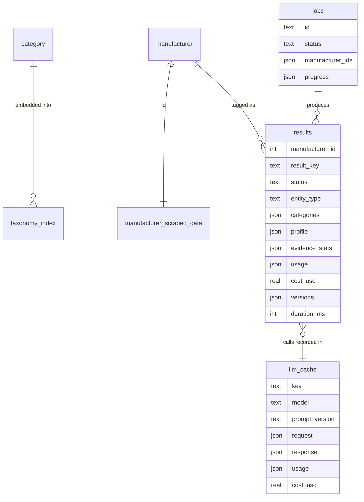
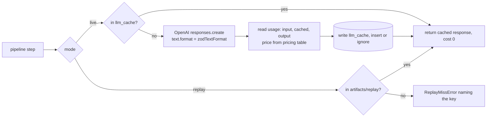
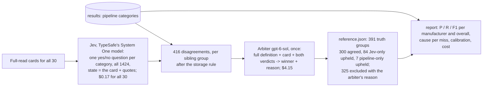

# Architecture

Owner's reading copy. Every design choice here comes from the grill session in `AI_LOG.md` entry 6 (Q1 to Q17) and the plan in `docs/plans/2026-09-22-001-feat-category-tagging-service-plan.md`. Numbers marked (measured) come from the dataset; numbers marked (est.) are estimates that the build replaces with measured ones.

Status: v4, built, measured and trimmed (2026-09-25). Sections 1.1 and 6 carry the numbers from the live run of all 30 manufacturers; accuracy is in section 8, `artifacts/report.md` and the README.

## 1. What the service does, in one paragraph

Give it a `manufacturer_id`. It reads that company's scraped website, throws away the junk, has a small model read all of what is left in windows, merges what it found into a short structured card about the company (what it makes, what it can make, whether it is even a manufacturer), uses that card to pull a shortlist of likely categories from the taxonomy, asks a model to judge each shortlisted category with a quote from the site as proof, checks those quotes and ids in code, applies a couple of rules, and stores the answer with confidence, quotes, and the exact cost in tokens and dollars.

### 1.1 Dataset facts (measured)

- 1424 categories (brief says ~2000), ids 388 to 6249 with gaps, so this is a subset of a larger taxonomy. No hierarchy column. Definitions 1206 to 2894 chars, none blank (brief says some may be, so blank is handled anyway)
- 30 manufacturers, 1:1 with scraped data. Markdown 52K to 2.13M chars, median 468K, total 17.8M. After dropping blank lines, placeholder URLs and duplicate lines (image alt text and link text kept): 5.94M (33%), `npm run cli -- clean-stats`
- Duplicate category names, different ids: Pumpkin Butter (1416, 1487), Ready To Drink Margarita (1738, 1740), Sweet Potato Chips (1231, 1244), Tea Mix (1699, 1710). So the contract returns ids, never names
- Storage-state siblings: 165 "Frozen", 162 "Refrigerated", 113 "Shelf Stable" names. Sites rarely state storage state
- Same company twice: Johnvince Foods, ids 8777 and 576761 (domain differs only by case)
- Not manufacturers: needl.co (marketplace, 3400 third-party listings), spcap.com and brynwoodpartners.com (private equity); the live run also classed exportsfromeurope.com (export promotion marketplace) and whitelabelpartners.com (provider directory) as marketplaces. mzb-group.com is a coffee group that owns its factories: the first prompt version called it an investor (AI_LOG.md entry 12), so the profile prompt now separates financial holdings from industrial groups
- Co-packers describe capabilities, not product lines (Carolina Beverage, Portland Bottling, Nellson, White Label Partners, INW, Assemblers, Tailored Bottling)
- Non-English: anona.de (German), monbana.com and lacharlotte.com (French)
- Thin taxonomy areas: one fragrance category (Perfume), one supplement category (Powder Supplements), no salt, no packaging. The brief's own examples are not in the sample
- No page URLs or page boundaries in the scrape; images are placeholders

## 2. The whole system

```mermaid
flowchart LR
  subgraph inputs [Inputs]
    SRC[(category_tagging.sqlite<br/>read-only)]
    ENV[.env keys]
  end

  subgraph offline [Offline, once per taxonomy version]
    IDX[Taxonomy index<br/>1424 vectors + names + sibling groups<br/>artifacts/taxonomy-index.*]
  end

  subgraph service [Tagging service]
    CLI[CLI<br/>tag, tag-all, serve, report]
    API[Fastify API<br/>jobs, results, sync tag]
    JOBS[Job runner<br/>table-backed queue]
    TAG[tag(manufacturer_id)<br/>the pipeline, section 3]
    LLM[LLM client<br/>live / replay<br/>cache + usage]
  end

  subgraph store [artifacts/tagging.sqlite]
    RES[(results)]
    CACHE[(llm_cache)]
    JOBT[(jobs)]
  end

  subgraph ext [External API]
    OAI[OpenAI<br/>gpt-6-luna window reads, merge, judge]
  end

  subgraph evalp [Evaluation, offline]
    REF[artifacts/reference.json<br/>391 truth groups, built once, section 8]
    REP[Report: P/R/F1, causes, calibration, cost]
  end

  SRC --> IDX
  SRC --> TAG
  CLI --> TAG
  API --> JOBS --> TAG
  API --> RES
  TAG --> LLM --> OAI
  LLM <--> CACHE
  TAG --> RES
  JOBS <--> JOBT
  IDX --> TAG
  RES & REF --> REP
```

Three things to notice:

- The pipeline (`tag`) is the only thing that writes `results`. CLI, API and eval all call it.
- The LLM client is the only thing that talks to OpenAI. Every call goes through the cache, so a re-run of an unchanged prompt costs nothing, and exporting the cache is what makes the no-key replay mode work.
- The evaluation side reads stored results and the committed reference set; it never re-runs the pipeline and makes no model calls.

## 3. The pipeline for one manufacturer

```mermaid
flowchart TD
  A[manufacturer_id] --> B[Load name, domain, markdown]
  B --> C0{Stored result with same<br/>content hash + taxonomy hash + every setting and prompt text?}
  C0 -- yes --> Z[Return cached result]
  C0 -- no --> C[Step 1 Clean<br/>drop blank / duplicate lines, keep image alt text, drop placeholder URLs]
  C --> D[Step 2 Chunk<br/>~1000 chars, a heading starts a new chunk]
  D --> E[Step 3 Read everything<br/>windows of ~10K tokens -> luna at low effort extracts products + quotes per window]
  E --> G[Step 5 Merge into the card<br/>entity type, products + quotes, capabilities + quotes, storage words]
  G --> G1[Check: every quote is in the text that was sent]
  G1 --> H[Step 6 Shortlist<br/>per phrase: dense + BM25 fused, top-8; union, sibling expansion, cap max(120, 3 x phrases), at most 600]
  H --> I[Step 7 Judge, LLM call 2 in batches of ~30<br/>per candidate: applies, confidence; quote + reason when applies]
  I --> J[Step 8 Validate<br/>id in shortlist? quote in evidence?]
  J --> K[Step 9 Policy<br/>storage rule, cutoff, entity type gate, status]
  K --> L[(Store result + usage + versions)]
  L --> Z
```

### Step 1. Clean

Input: the raw markdown, which is every page of the site pasted end to end, nav bars repeated per page, and every image replaced by the same placeholder URL. There are no pixels and no original image URLs, so images cannot be read. What survives of each image is its alt text, and that is worth keeping: 22,577 image tags carry alt text, 5,443 distinct, and many name products ("ZEUS - Fruit Juices", "Traditional Balsamic Vinegar of Modena PDO", "Tata copper plus") (measured).

Rules, applied per line:
- trim whitespace, drop empty lines
- replace each image tag `` with its alt text, then drop any bare placeholder URL; the rest of the line stays. 4,091 of the 36,793 placeholder lines carry other text besides the image (measured), so dropping whole lines would lose it
- turn `[link text](url)` into `link text`
- drop a line if its normalised form (lowercased, whitespace collapsed) has already been seen in this site
- drop lines that are only punctuation or one character

Why line-level dedupe works so well here: every page repeats the same menu and footer, so the first page keeps them and every later page loses them. Measured (`npm run cli -- clean-stats`): 17.8M chars become 5.94M (33%). Krier Foods 177K to 59K; Monbana 528K to 83K; needl.co 2.13M to 757K.

All of this is plain string code, no model. Why it can be trusted: every rule is deterministic and only removes things that can be named exactly (repeats, placeholder URLs, link targets, empties, separators). Nothing here judges what is important; that is steps 3 to 5. Dedupe keeps the first occurrence, so a product name that appears on five pages is kept once, never lost. Two checks keep it honest: every stored result carries the raw-to-cleaned character ratio so an odd site stands out, and `clean-stats --show-dropped <id>` prints a sample of the dropped lines per site so the owner can eyeball what went (planned for a co-packer, a non-English site and needl.co before the pipeline is trusted).

What it does not do: it does not decide what is a product. That is the model's job in steps 3 to 5.

### Step 2. Chunk

Cut the cleaned text into pieces of about 1,000 characters, splitting on headings and blank lines, merging small pieces, and not splitting mid-sentence when avoidable. Each chunk remembers its position in the cleaned text (the judge's evidence uses it to always include the site head).

Why ~1,000: small enough that one chunk is about one topic (so its score in step 4 means something), big enough that a product description with its context fits. Windows in step 3 are built from whole chunks so a product description is never cut in half.

### Step 3. Read everything

The whole cleaned site goes to `gpt-6-luna` at low reasoning effort, in windows of about 10K tokens (40K chars; measured 4.0 chars per token) made of consecutive chunks, run four at a time. Each window call returns the same structured items as the card in step 5: products with a verbatim quote and any storage word, capabilities with a quote, brands, and a vote on entity type.

Why everything and not a scored subset (owner's decision during the review, AI_LOG.md entry 8, then measured): the brief grades correctness, and a subset reader can silently drop a product the model never gets to see. A selection lever was built (contrastive chunk scoring from the two probes in `docs/probes/`, always-include rules for the site head and entity sentences, per-heading cap, character budget) and measured on all 30 sites against two full reads (`artifacts/budget-study.json`): the two full reads disagree on 90 of 919 products (9.8%, the noise floor); selection at 16K / 32K / 64K chars lost 307 of 862, 305 of 837 and 199 of 664 products on the sites over budget, beyond the floor on 15 / 16 / 13 of them. Raising the budget does not rescue it: cleaned sites are median 110K chars, only 14 exceed 128K, 7 exceed 256K and 3 exceed 512K, so a large budget is a full read for most sites and cuts exactly the product-rich ones where the loss was measured, to save a few cents of a $0.017 site. The lever was removed from the code; the study stays as the evidence.

Full read is a ceiling, not perfection: two reads of the same site disagree on about one product in ten, and that run-to-run noise bounds what any accuracy number below it can mean.

### Step 4. (removed)

Kept as a number so the step names in the code and the log still line up. Selection lived here; see step 3.

### Step 5. Merge into the card (LLM call, `gpt-6-luna`)

The window results from step 3 are merged by one call into a structured card:

```
entity_type:   manufacturer | co_packer | both | marketplace | investor | distributor | other
products:      [{ name (English), quote (verbatim), storage: frozen | refrigerated | shelf_stable | null }]
capabilities:  [{ name, quote }]
brands:        [..]
site_language: ..
summary:       one sentence
```

Merge rules: products are deduplicated by normalised name, one quote kept per product; entity type is decided from the window votes with the first window (home page) weighted highest; a marketplace's listings and an investor's portfolio are not this company's products; every quote copied exactly; product names in English even if the site is not.

Check in code: every quote must be found in the evidence that was sent, after both sides are normalised (Unicode NFKC, lowercase, curly quotes and dashes unified, markdown symbols stripped, whitespace collapsed). Models tend to drop `**` and straighten quotes, and a byte-exact check would reject faithful quotes. Exact matches count as verified; a fuzzy match (at least 80% of the quote's **distinct** words inside one window of the quote's length — distinct, so a repeated word cannot pay for an invented one) is kept but counted separately; anything else is dropped and counted. This is the first hallucination guard.

Why the card exists at all: it turns a messy multilingual site into a clean English search query for step 6, and it decides once whether the company is a manufacturer, a co-packer, a marketplace or an investor, so that decision does not have to be re-argued per category. It was also the state given to Jev when the reference set was built (section 8).

### Step 6. Shortlist

What is embedded: each `products[].name` and `capabilities[].name` from the card, the short English label ("Coffee Beans", "Oblong tablets"), not the quote. Quotes stay attached to the phrase as evidence for the judge; summary, brands, entity type and storage words are not embedded (storage words feed the policy step). A bare name such as "Powder" or "Bars" loses context. Decision rule (owner's, AI_LOG.md entry 8): name-only is the starting rule; the three variants (name-only, name + quote, and conditional — name + quote only when the name is one or two tokens or the name-only top-8 has a low margin) were then run over the 30 cards against the reference set at zero model cost. Result (`artifacts/query-mode-study.json`): name misses 22 of the 391 truth groups, name + quote 22 at a smaller mean shortlist (153 vs 162), conditional 25. No gain, so `QUERY_MODE=name` ships and the other two stay runnable through `cli shortlist <id> --mode ...`. Name + summary is rejected: the summary is the same sentence for every row, so every query is pulled toward one centroid, the per-phrase lists overlap, and minor product lines drop out.

For each product and capability phrase from the card, two searches run and are fused:
- dense: embed the phrase (as a query), nearest categories by cosine
- lexical: BM25 over category name + definition, whole words only (249 category names are substrings of other names: "Italian" the dressing would otherwise match "Italian sausage")

The two ranked lists are merged with reciprocal rank fusion (a category near the top of either list ranks high; near the top of both ranks highest). Top 8 per phrase. Union everything, keep the best fused score per category and remember which phrase matched it and by which path. Then sibling expansion: for every candidate, add all of its storage / qualifier siblings (Frozen X, Refrigerated X, Shelf Stable X, and bare X). This puts the contrast in front of the judge so the storage rule can be applied with the definitions visible.

Cap at max(120, 3 x card phrases), and never above 600 (20 judge batches, so no site can pull in the whole taxonomy; the largest shortlist over the 30 is 527 and the largest card 196 phrases, so the ceiling never binds), by best score, never splitting a sibling group: a group that does not fit is skipped whole and a smaller one behind it still gets in. Measured mean over the 30 manufacturers: 140 candidates (`artifacts/query-mode-study.json`).

The cap, not `k`, is what decides retrieval recall, and buying more of it does not pay (`artifacts/retrieval-study.json`): raising `k` from 8 to 24 alone changes nothing, because the extra candidates compete for the same slots, while raising the cap to 600 at k=16 cuts the groups the judge never sees from 22 to 6. Run live, that converted 13 of them into true positives and brought 20 new false positives with them: precision 95.0% to 89.9%, F1 86.0% to 85.7%, cost $510 to $795 per 30,000. Rejected.

Why a shortlist and not all 1424: the judge call would be ~40x bigger and the model would be picking from a wall of names, many of them single ambiguous words (Round, Loin, Ice, Thins). Every published system in `docs/RESEARCH.md` does retrieve-then-judge.

### Step 7. Judge (LLM call 2, `gpt-6-luna` to start)

Input: the card, the quotes, the evidence blocks, and the candidates as `{id, name, first ~300 chars of definition}`.

Not all at once. Long candidate lists make models attend to the top and bottom and neglect the middle ("lost in the middle"), so the shortlist is judged in batches of about 30, ordered by retrieval score, with sibling groups kept in the same batch. Every batch starts with the same text (instructions, card, evidence) and ends with its candidates, so OpenAI's prompt cache serves the shared prefix at a tenth of the price and the batching costs little extra.

Output, per candidate: `{ id, applies, confidence 0-1, reason }` — a reason on every verdict, not only on the ones that apply (owner's decision: an unexplained rejection cannot be reviewed) — plus `quote` when `applies` is true.

The prompt states the two rules: tag only when the site names the product type (not "we fill beverages" alone), and only claim a storage variant if a storage word appears with that product.

### Step 8. Validate (code, no model)

- an id that was not in the batch is dropped and counted as `unknownIds` (so an invented category can never leave the service); an id answered twice in one batch is counted as `repeatedIds` and the repeat ignored
- a candidate the model never answered for becomes `applies: false` flagged `missing_from_output`, so the verdict count always equals the candidate count
- `applies: true` with a quote that is not in the evidence (same normalised check as step 5) becomes `applies: false` with reason `quote_not_found`

### Step 9. Policy (code, no model)

- Storage rule: a storage-qualified category passes only if the product on the card has that storage word or the quote contains one. Storage words are matched as whole words in any script (JavaScript's `\b` is ASCII-only, so "plat surgelé" and "produit réfrigéré" never counted before), in English, German and French. "Fresh" is deliberately not one of them, and since the profile prompt does list it, a card product whose own quote says "fresh" and names no storage word is not taken as evidence either. If a sibling in the same group *is* evidenced, the site did state a storage state for this product, so the unevidenced variants are simply dropped (`storage_sibling_weaker`). Otherwise, if the bare sibling exists, the verdict moves to it — the bare one, found by `baseName(name) === name`, not merely one without a storage prefix, because the taxonomy also qualifies by Diet, Plant Based and Ready To Drink and "Diet Orange" is not the unqualified category. If only qualified siblings exist (285 base names in this taxonomy exist only in qualified form: Mayonnaise, Frozen Dumpling ...), keep the strongest at its judge confidence and mark it `storage_inferred: true` with the reason. An earlier draft multiplied the confidence by 0.7 here; that would have let the cutoff below silently drop a fifth of the taxonomy.
- Cutoff: return `applies && judge_confidence >= cutoff`, initial cutoff 0.6. Self-reported confidence is known to be poorly calibrated, and log-probabilities are not available with structured outputs, so the cutoff is not trusted as-is: every accepted verdict is binned by confidence against the reference set and the cutoff is read off that table (no verdict below 0.7, identical F1 from 0.5 to 0.7, so 0.6 stays). The retrieval score is stored beside the confidence for the same reason. Below-cutoff verdicts are stored as `rejected` for inspection.
- Entity gate: for `marketplace` / `investor` / `distributor` the default policy returns an empty list with status `not_a_manufacturer` — the three types both prompts already say do not own what they list, fund or resell. Keychain confirmed the empty answer is the correct one (README question 2); `NON_MANUFACTURER_POLICY=tag` flips it.
- Status: `tagged`, `no_confident_category`, `not_a_manufacturer`, `insufficient_content`, `error`.

### What gets stored

manufacturer id, result key (manufacturer id + cleaned-content hash + taxonomy hash + `versions`: every setting in `src/config.ts` except the key, the mode, file paths and concurrency, plus a hash of the prompt files' text — built by leaving out, not by listing in, after a hand-kept list twice missed settings; code is not in it, so a code change is re-tagged with `--force`), status, entity type, accepted categories (id, confidence, quote, reason, matched-by), rejected ones with reasons, the card, evidence stats (`rawChars`, `cleanedChars`, `chunks`, `windows`, `judgeEvidenceChars`, `quotes.{exact,fuzzy,none}`, `shortlist`, `batches`, `unknownIds`, `repeatedIds`), usage per call and total (input, cached, output, reasoning tokens), cost in dollars (every billed attempt, charged as it returns, so a run that fails halfway is stored with what it cost), versions, duration.

A failed run is stored too, under its own key (`<result key>:error`): kept for diagnosis, never served, retried on the next call, and unable to overwrite an answer already stored for the same input. `results.current(manufacturer, versions)` is the single rule for "the current answer" — rows of the current `versions` only, an answer before a failure, newest first — and both the API and the report read through it.

## 4. Data model



Source tables (`category`, `manufacturer`, `manufacturer_scraped_data`) are never written. Everything else lives in `artifacts/tagging.sqlite`.

## 5. LLM client: live, replay



Tests fake the model where a real provider would plug in, as a `Transport` (`test/fake-llm.ts`), so they run through the same parse, retry, cache and cost path as a live call; there is no third mode that skips the cache.

Only `live` is given a transport, so replay cannot reach the network whatever `OPENAI_API_KEY` holds: a miss is an error, never a surprise bill. A model with no price fails before the transport is called, not after it has billed. Cache rows are written with `insert or ignore` — a key is the whole request, so an existing row already answers it, and a second process cannot rewrite evidence that has been exported. The one exception is a cached row that no longer parses (an output schema changed without a prompt-version bump): the fresh answer replaces it, or every later run would pay for the same call again.

A parse failure is retried once with the validation error appended to the prompt; a second failure is a typed error and the manufacturer's result is stored as `error`, never half-tagged.

Cost is never estimated: it is `usage x price`, with the price table carrying the date and URL it was read from.

## 6. Cost: where it goes and the levers

Where the money goes (measured, live run of all 30 on `gpt-6-luna`, `artifacts/report.md`): $0.51 for 30 manufacturers, mean $0.017, median $0.012, max $0.075 (bigbrandsllc.com, 121 products); 3.23M input tokens of which the window reads are 47% and the judge batches 53%, 374K output tokens. Retrieval and scoring are free (local model). Projected for 30,000 manufacturers: $510, or $255 on the Batch API. The same run on `gpt-5.6-luna` cost $1.01. Prompt cache hits were 0%: on GPT-5.6 and later the cache needs an explicit breakpoint and charges writes at 1.25x, so it is a lever still to take on the judge prefix (estimated 10 to 15%).

| Lever | What it does | How it is decided |
|---|---|---|
| Line-level cleaning | 67% fewer chars before any model touches the text | measured, free |
| One model, effort dialled down | `gpt-6-luna` for every pipeline call; reasoning effort low for the window reads and the merge, default for the judge; the judge would move to a bigger model only if the cause breakdown said the judge is the weak link, and it says the opposite: 60 of the 84 misses are the judge reading a definition too narrowly, which a prompt change addresses more cheaply (tested, see the README's rejected v3) | report |
| Evidence selection (built, measured, removed) | read a scored subset instead of the whole site | `artifacts/budget-study.json`: loses 3x the noise floor at every budget; would have saved $0.27 to $0.35 per 30 profiles. See step 3 |
| Trimmed definitions in the judge | 300 chars instead of ~1,700 per candidate | fixed |
| Shortlist cap and judge batching | bounds the judge call; batches share a prefix meant for the prompt cache | cap max(120, 3 x card phrases) with a hard ceiling of 600, batches of ~30; measured cache hit share 0%, see above |
| Cache by prompt hash | re-runs of unchanged prompts are free; replay for reviewers | built in |
| Result cache by content hash | an unchanged site is never re-tagged | built in |
| OpenAI Batch API | 50% off for a full-base run | documented as a lever, not built |

When it stops: every window is read once, the shortlist is capped (at most 600 candidates, 20 judge batches), one retry at most. There is no loop that can run away, and no manufacturer can cost more than its site's windows plus 20 batches.

## 7. Service contract

```
POST /v1/tagging-jobs                 { manufacturer_ids?: [..], all?: true, force?: false }
                                      -> 202 { job_id, manufacturers }  (repeated ids counted once)
                                      -> 400 { error: "unknown_manufacturer", manufacturer_ids }
                                         if any id is not in the dataset; nothing is queued
GET  /v1/tagging-jobs/:id             -> 200 { job_id, status, counts: { total, pending, done, failed },
                                               cost_usd, manufacturers: { "<id>": { status, result_key,
                                               status_detail, cost_usd, error? } }, created_at, updated_at }
                                      -> 404 { error: "job_not_found" }
GET  /v1/manufacturers/:id/categories -> 200 the current pipeline's answer; 502 with the same body if
                                      its last attempt failed and no answer exists; 404 { error:
                                      "not_tagged" }, also when only another version's answer exists
POST /v1/manufacturers/:id/tag        ?wait=true runs now -> 200 result (502 with the same body on a
                                      pipeline error); without wait -> 202 { job_id };
                                      unknown id -> 404 { error: "unknown_manufacturer" }
GET  /healthz                         -> 200 { ok, mode }
any route, Host not localhost or a browser Origin from another site -> 403 { error: "forbidden" }
```

Why this shape: the platform "runs across the full manufacturer base", which is a job, not 30,000 blocking calls. One sync endpoint exists for the one-off case and for the demo. Results are idempotent on the result key (see step 9), so calling twice is safe and cheap, every result says which versions produced it, and two callers asking for the same manufacturer at the same moment share one pipeline run rather than paying twice.

The job runner is a table-backed loop inside the process: pending jobs resume after a restart, and a job that fails outside its per-item guard is marked `failed` while the loop drains the rest. If Keychain has a queue, the contract does not change. A job can never be bigger than the dataset (ids are deduplicated and checked before anything is queued), and the loop yields to the event loop after every manufacturer, so a job of already-stored answers cannot hold the server. Its one known limit is scale: a job keeps its per-manufacturer state in a single `items` column, which is fine for 30 and would be a few megabytes rewritten per completion at 30,000 — a `job_items` table is the fix, and it is not built.

## 8. The reference set and how the pipeline is scored

There is no hand-labelled answer key. One was built once, in three steps, and committed as `artifacts/reference.json`:



Why an independent model over all 1,424 and not our own shortlist: a reference that shares the pipeline's retrieval inherits its misses, and the point was to measure those (`not_in_shortlist`, `not_on_card`). Why an arbiter: Jev proved generous (56 positives for refresco.com against 15 returned); of the 416 disagreements the arbiter sided with the pipeline 316 times and with Jev 100 times, so scoring against raw Jev would have punished correct rejections. Neither Jev nor the arbiter is part of the pipeline; the TypeSafe SDK is not in the repo any more; `npm run cli -- report` reads the stored results and the reference file and makes no model calls.

What the report leaves behind: `artifacts/report.md` (accuracy, misses by cause and by manufacturer, calibration, cost), `artifacts/calibration.json`, and the earlier `artifacts/spot-check.md` (20 arbiter verdicts for the owner's eye). Known limits, stated in the README: the reference is only as good as one Jev run corrected by one sol pass; where the pipeline, Jev and the arbiter all agree, nobody checked; and the five `not_a_manufacturer` answers are agreed by construction (Keychain's answer 2), so a wrong entity gate is invisible to it. `artifacts/query-mode-study.json` reuses the reference to compare the three retrieval query modes at zero model cost.

## 9. Where the model is trusted and where it is not

| Decision | Who makes it | Why |
|---|---|---|
| Which lines are junk | code | deterministic, free, measured |
| Which chunks to read | nobody: everything is read. A selection lever was built, measured and removed (step 3) | correctness is graded, and a dropped chunk is unrecoverable |
| What the company makes, whether it is a manufacturer | LLM (profile) | needs reading comprehension. The products are guarded by the quote check; the entity type is not (no quote is asked for it), which is why the five `not_a_manufacturer` answers are flagged for a human in the README |
| Which categories to consider | embeddings + exact names | fast, and the judge never sees anything else |
| Whether a category applies | LLM (judge) | needs the definition and the evidence side by side |
| Whether the id is real, whether the quote is real | code | structural guarantees, no trust needed |
| Storage variant when unstated | code (policy) | the model guesses badly here; the rule is explainable |
| Whether the pipeline was right | Jev + arbiter + owner spot-check | independent second opinion, human on the mismatches |

### 9.1 Guards, guardrails and evals

Three layers keep the model from making basic mistakes. Guards are code that runs on every request and blocks bad output. Guardrails are limits on what the model is even allowed to decide. Evals run once, offline, and measure how good the output is. Every row says what mistake it stops, where it sits, and what it leaves behind so you can see it firing.

**Layer 1: per-request guards (code, every call)**

| Guard | Mistake it stops | Where | What it leaves behind |
|---|---|---|---|
| Quote must be in the text sent | the model "remembers" a product from its training instead of reading the site, or invents a quote | step 5, after the merge | `evidence.quotes.{exact,fuzzy,none}` per result (2,452 / 22 / 8 over the 30). A quote with no word in it ("...") counts as not found. What it does not prove: that the quote names the category. A one-word quote is valid (most are product-list items), so a page written to steer the model could get past it; README "With more time" |
| Id must be in the batch | the judge names a category it was never shown | step 8 | `evidence.unknownIds` and `evidence.repeatedIds` (0 / 0 over the 30) |
| `applies` needs a found quote | the judge says yes without evidence | step 8 | verdict flipped to no, reason `quote_not_found`, counted |
| Storage variant needs a storage word | Frozen X claimed when the site only says X | step 9 | verdict moved to the bare sibling, or `storage_inferred: true` with reason |
| One retry, then `error` | malformed JSON silently becomes a half-tagged manufacturer | LLM client, section 5 | `status: error` carrying both raw outputs in the message, the tokens already spent still charged, and the row retried on the next call rather than served back |
| Fixed bounds | a runaway loop or an unbounded prompt | section 6 | window count, shortlist cap max(120, 3 x phrases) up to 600, batch size ~30, one retry max |
| Local-only API | a web page starting a billed run through the user's browser | `api/server.ts` | `403` for a foreign Host or Origin |

**Layer 2: guardrails (what the model may decide)**

| Guardrail | Mistake it stops | Where |
|---|---|---|
| Judge chooses only from the shortlist | hallucinated categories; structurally impossible, not merely unlikely | steps 6 to 8 |
| Ids, never names | four category names exist twice with different ids; a name is ambiguous, an id is not | contract, section 7 |
| Definitions shown, trimmed | single-word names (Round, Loin, Ice, Thins) misread without their definition | step 7 |
| Sibling groups judged together | Refrigerated X chosen without seeing Shelf Stable X and X beside it | step 6 |
| Entity gate before tagging | a marketplace, investor or distributor tagged with everything it lists, owns or resells | steps 5 and 9 |
| Confidence cutoff set from data, not trusted as given | self-reported confidence is poorly calibrated; the calibration table showed no verdict below 0.7 and identical F1 from 0.5 to 0.7, so 0.6 stays and the quote + reason are the reviewable signal | step 9, section 8 |
| Trust table (section 9) | the model deciding things code should decide (dedupe, id validity, quote validity, storage policy) | whole pipeline |

**Layer 3: evals (offline, no model calls)**

| Eval | Question it answers | What it leaves behind |
|---|---|---|
| Score against `artifacts/reference.json` (built once from Jev + arbiter, section 8) | how many of the 391 known-correct groups come back, and how many returned groups are wrong? | P / R / F1 per manufacturer and overall in `artifacts/report.md` |
| Cause breakdown | which stage lost each missed group: `not_on_card`, `not_in_shortlist`, `judge_rejected`, `below_cutoff`, `policy_moved`, `entity_gate`, `quote_not_found` | counts per cause in the report, summing to the false negatives; wrong tags are listed apart |
| Calibration table | does a 0.8 mean 80%, and would another cutoff score better? | confidence bins and a cutoff table in `artifacts/calibration.json`, scored against all 391 reference groups so it is the same metric as the accuracy table |
| Second full read per site | how much do two reads of the same site disagree? | `artifacts/budget-study.json`: 9.8% |
| Query-mode study | does name + quote or a conditional query shortlist more of the reference? | `artifacts/query-mode-study.json`: no (22 / 22 / 25 of 391 missed) |
| Retrieval study | can the 18 groups the judge never sees be bought back, and does buying them pay? | `artifacts/retrieval-study.json`: yes and no - the cap buys them (22 misses down to 3), and live it trades 5 points of precision for 3 of recall at 56% more cost |
| No-key replay of a fresh copy | does the whole run reproduce without a key, byte for byte on cost? | the fresh-copy check, identical total |
| Owner spot-check | is the arbiter itself right? | `artifacts/spot-check.md`, 20 verdicts with an Owner column |
| Cost table | what does each manufacturer cost, and each call type, and the whole base? | measured tokens and dollars, x30,000 projection |

## 10. Not built, on purpose

Frontend, auth, deployment, ingestion (the brief says no). A vector database (1424 x 384 floats is 2 MB). Hierarchy extraction from the definition prose. A fine-tuned or distilled classifier (the right move at 30K+ manufacturers once labels exist; Mercari describes it). Batch API submission. Agent frameworks.

## 11. Review pass (2026-09-22)

Three checks were run on the first draft: a web research pass on better alternatives per stage, an adversarial review of the plan against the brief and the dataset, and two empirical probes with the real embedding model on real sites (`docs/probes/`). What changed:

| Change | Why |
|---|---|
| Chunk scoring is contrastive, not "closest category" (selection lever, later removed) | Probe 01 showed the original does not separate product text from job ads and privacy pages; probe 02 showed the contrastive version does, in English and German |
| Full read with `gpt-6-luna` at low effort is the default; selection was an off-by-default lever that had to prove no loss, was measured, and was removed (step 3) | Owner's decision during the page review (AI_LOG.md entry 8): the brief grades correctness, a subset reader can silently drop products, and the cost gap (est. ~$350 vs ~$120 per 30K re-tag) does not buy back a recall cap. The earlier 90% / 75% study bar was the AI's invention and is gone |
| Hybrid BM25 + dense retrieval with rank fusion | Published as a reliable gain over dense-only at near-zero cost; also fixes substring over-matching of short category names |
| Judge in batches of ~30 with a cached shared prefix | Lost-in-the-middle is documented at ~100-item lists; batching with prompt caching costs little |
| No 0.7 confidence multiplier; `storage_inferred` flag instead | The multiplier combined with the 0.6 cutoff would have silently dropped every product whose category exists only in qualified form (285 base names) |
| Cutoff chosen from a calibration table, not assumed | Self-reported LLM confidence is poorly calibrated and log-probabilities are unavailable with structured output |
| Quote check normalises typography and markdown, with a fuzzy tier | Byte-exact checks reject faithful quotes; a known failure mode, worse on German / French text |
| Mismatches diffed per sibling group; arbiter dry run | A product with unknown storage would otherwise create three mismatches and the arbiter bill would run away |

Rejected after the review: a cross-encoder reranker (latency for marginal gain; the judge already discriminates on the shortlist), HyDE-style query generation for selection (an extra LLM call that embedding the definitions already covers), larger embedding models (5x the size, some without ONNX weights; e5-small proved adequate in the probes), and a human-labelled gold set (research treats one as near-mandatory; the owner chose Jev + arbiter + spot-check in grill Q1, and the spot-check list is built so it can grow to 50 items).
