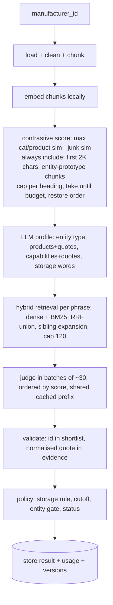

# feat: Category Tagging Service

> Historical: this is the plan as approved on 2026-09-22, kept as the record of what was agreed
> before any code. Three things in it were later built, measured and removed — the chunk-selection
> lever (`cli -- select`), the Jev reference run (`cli -- jev`) and the standalone `cli -- judge`
> command — so those commands do not exist in `src/cli.ts`. See AI_LOG.md entries 15 and 16.

## Summary

A Node + TypeScript service that tags one manufacturer at a time: clean the scraped site, read all of it with luna at low effort in windows, merge into a profile card, run batched judge calls against a hybrid-retrieved shortlist, validate in code, and store the result with quotes, confidence and measured cost. Beside it: a second full read of every site (the noise floor for the selection lever), a Jev run over all 1,424 categories, an arbiter for mismatches, and a report that also decides whether the selection lever may be enabled and sets the confidence cutoff from data. Four phases; each ends with a number you can check.

Revision 2 (same day): folds in an alternatives research pass, an adversarial review, and two empirical probes (`docs/probes/`). Changes from revision 1 are listed at the end.

---

## Problem Frame

Keychain's brief (`docs/ASSIGNMENT.md`): given a `manufacturer_id`, return the category ids from a ~1,400-row taxonomy that apply, using 50K to 2.1M chars of scraped markdown per manufacturer, with an LLM, under cost pressure. Graded on approach, AI judgment, cost reasoning, contract design, correctness against a private gold set, engineering judgment, and the AI usage log. There is a live walkthrough where the owner extends the code. Design decisions were made in the grill session in `AI_LOG.md` entry 6 (Q1 to Q17). Two are parked until the Keychain team answers: what to return for non-manufacturers (Q4) and how results are scored.

---

## Requirements

- R1. `tag(manufacturer_id)` returns category ids that exist in the `category` table, each with confidence, a verbatim quote from the site, and a short reason. Ids not in the judge's shortlist can never be returned (enforced in code)
- R2. Works end-to-end on every manufacturer in `data/category_tagging.sqlite`, one at a time and as a batch of all 30
- R3. Runs with no API key in replay mode (committed real responses and evidence) and in stub mode (tests); live mode uses `OPENAI_API_KEY` / `TYPESAFE_API_KEY` from `.env`
- R4. Every result records tokens (input, cached, output) and dollars per call and per manufacturer, read from API usage fields, never estimated
- R5. Tag semantics: "makes or can make", tagged only when the site names the product type (Q2, Q3). Storage-qualified variants only when a storage word was found near the product (Q8)
- R6. "No confident category" and "not a manufacturer" are valid statuses, not errors
- R7. Blank or missing category definitions do not break indexing or prompting
- R8. Nothing hardcoded to 1,424 categories, 30 manufacturers, or food; taxonomy index rebuilds when the category table's hash changes
- R9. HTTP contract: batch job endpoints, stored-result endpoint, single sync endpoint (Q12); idempotent on content hash + taxonomy hash + prompt versions
- R10. Jev reference over all categories per manufacturer, with state independent of the pipeline's evidence selection; mismatches arbitrated by `gpt-5.6-sol`; report with precision / recall / F1, mismatch causes, calibration table; owner spot-checks arbiter verdicts (Q1, Q1b, Q10b, Q14)
- R11. The selection lever stays off unless the budget study on all 30 manufacturers shows it loses no product beyond the full-read noise floor; the confidence cutoff (Q16) is chosen from the calibration table; both measurements are reported
- R12. README documents decisions, trade-offs, assumptions, measured results, what was not built; `AI_LOG.md` kept per `CLAUDE.md`

---

## Scope Boundaries

- No frontend, auth, deployment, ingestion
- No vector database; category vectors live in a `Float32Array` in a committed file
- No hierarchy extraction from definitions, no fine-tuned classifier, no distillation
- No cross-encoder reranker between shortlist and judge (research: 200 ms to 2.5 s per query for marginal gain; the judge already does fine discrimination on the shortlist)
- No OpenAI Batch API submission; documented as a lever with the 50% saving it would give
- No live re-tagging on content change; the cache key makes it correct if it happens, but no watcher

### Deferred to Follow-Up Work

- Non-manufacturer return policy (Q4): a config flag with a default, flipped when the team answers
- Confidence cutoff and storage-variant policy re-tuned once the team says how they score
- Human-labelled gold set: research treats one as near-mandatory for calibrating an LLM reference; owner chose the Jev + arbiter + spot-check path (Q1, Q1b). The spot-check list is built so it can be extended to ~50 items if the owner decides to

---

## Context & Research

### Relevant Code and Patterns

Greenfield. Measured dataset facts in `ARCHITECTURE.md` section 1.1. Two probes in `docs/probes/`:
- Probe 01: "max cosine to any category" does NOT rank product chunks above junk (flat 0.80 to 0.86; job postings and privacy text at the top). Phrase-to-category retrieval works (Kaffeebohnen -> Coffee Beans)
- Probe 02: contrastive scoring (max of category / product-prototype similarity minus junk-prototype similarity) ranks canning, blending and product pages first and job postings, privacy text last, on English and German sites. Category-word density is noisy and dropped

### External References

`docs/RESEARCH.md`: prior art (Instacart, Mercari, Shopify), SDK facts and prices; plus the alternatives pass: MMR / page diversity for selection, hybrid BM25 + dense with RRF (clearly better than pure dense at low cost), lost-in-the-middle at ~100-candidate listwise prompts (batch to ~25-30, ordered by score), self-reported LLM confidence is poorly calibrated and logprobs are unavailable with structured outputs on the Responses API, typographic normalisation before quote checks, cross-family LLM-as-judge as the standard bias mitigation.

---

## Key Technical Decisions

- **Two LLM stages per manufacturer (profile, judge), not one**: raw page text is a poor retrieval query and mixes languages; a short English profile with quotes is a good query and is where entity type is decided once (Q6, Q7)
- **Contrastive chunk scoring, not max-cosine** (probe 01 vs 02): score = max(sim to any category, sim to product / capability prototypes) minus sim to junk prototypes (careers, privacy, contact, press-release, community; with German and French prototypes). The site's first ~2K cleaned chars are always included (title, nav, home) so the entity-type signal is never dropped, and chunks close to entity prototypes (marketplace, investor / portfolio, distributor) are always included. At most N chunks per heading so one product page cannot fill the budget
- **Full read is the default profile path; selection is an off-by-default cost lever that must prove no loss** (owner's decision during the architecture page review, AI_LOG.md entry 8, replacing grill Q5): windows of ~10K tokens over all cleaned chunks with `gpt-5.6-luna` at low effort, merged by one luna call (est. ~$0.01 per site). The budget study runs two full reads per site to get the noise floor, then selection at 16K / 32K / 64K; the lever is enabled only for a budget that loses no product beyond that floor on every site. The full-read card is the Jev state
- **Models**: `gpt-5.6-luna` for every pipeline call, reasoning effort low for extraction and default for the judge, no nano tier (owner's call); `gpt-5.6-sol` for the arbiter; `jev-latest` for the reference. Model ids and effort are config, not code
- **Hybrid retrieval**: dense top-k per phrase plus BM25 over name + definition (whole-word), fused with reciprocal rank fusion; replaces the naive substring lexical path (249 category names are substrings of other names: Dip, Ranch, Italian)
- **Judge in batches of ~30 candidates ordered by fused retrieval score, sibling groups kept together**, each batch with the same cached prefix (instructions, profile, evidence first; candidates last) so prompt caching pays for the repetition. Quote and reason only for `applies: true`; output token limit derived from batch size
- **Judge picks only from the shortlist; code enforces it**: hallucinated ids are impossible (R1)
- **Quote check after normalisation**: NFKC, casefold, unify curly quotes and dashes, strip markdown punctuation (`*`, `#`, `_`, backticks), collapse whitespace, on both sides; exact match counts as verified, a fuzzy tier (high token overlap within a window) is counted separately and reported, everything else is `quote_not_found`
- **Confidence is stored, not blindly thresholded**: each accepted category carries `judge_confidence` and `retrieval_score`. The initial cutoff is 0.6 on judge confidence (Q16); phase D produces a calibration table (confidence bins vs arbiter agreement) and the final cutoff is set from it and stated in the README
- **Storage rule without a penalty multiplier**: when the storage state is not evidenced and only qualified siblings exist, the best one is returned at judge confidence with `storage_inferred: true` and the reason, so it is not silently killed by the cutoff (adversarial finding 2)
- **Sibling expansion in the shortlist**: all storage / qualifier siblings of a candidate are added so the judge sees the contrast; max group size in this taxonomy is 3, so it cannot blow the cap
- **Replay stores evidence, not just responses**: replay files carry the selected evidence per manufacturer; replay uses it instead of re-selecting, so chunk-order differences across machines cannot cause a miss. A replay miss when a key is present falls through to live and is logged
- **Duplicate-name categories**: both ids are returned when both apply; the definitions differ, so they are different concepts (stated in README)
- **`llm_cache` is both the runtime cache and the replay source**; jobs run in-process; models and prompt versions are config

---

## Open Questions

### Resolved During Planning

- Jev state per judgment: the full-read profile (products, capabilities, quotes, entity type), under 32K tokens; truncation recorded
- 1,424 questions exceed one 64K-token request: chunks of ~300 questions; cost under $1 for all 30
- Mismatch diff is done per sibling group after applying the storage policy to Jev positives, so a null-storage product does not create three mismatches; the arbiter run prints the mismatch count and projected cost before spending
- Token estimate for the budget: chars / 4, corrected by the measured ratio after the first live runs
- e5 prefixes: `passage:` for categories, chunks and prototypes; `query:` for product phrases

### Deferred to Implementation

- Chunk size and per-heading cap: start 1,000 chars and 4 per heading; tune only if U10 shows loss
- Retrieval k, BM25 parameters, RRF constant, shortlist cap: start k=8, standard BM25 defaults, cap 120; tune against the reference in phase D
- Judge batch size: start 30; drop to 20 if parse failures or the calibration table say so
- Whether `gpt-5.6-luna` is good enough for the judge or needs `gpt-5.6-terra`: decided by the phase D cause breakdown
- Worker concurrency: start 3

---

## Output Structure

    keychain-category-tagging/
      package.json, tsconfig.json, vitest.config.ts, .env.example
      src/
        config.ts                 env, model ids, budgets, thresholds, prompt versions, flags
        db/
          source.ts               read-only open of data/category_tagging.sqlite, typed readers
          store.ts                artifacts/tagging.sqlite: results, llm_cache, jobs, jev_answers, arbiter_verdicts
        text/
          clean.ts, chunk.ts, normalize.ts (quote-check normalisation)
        index/
          embed.ts                local embedding wrapper
          taxonomy.ts             vectors, BM25, RRF search, name lookup, sibling groups
          prototypes.ts           junk / product / capability / entity prototype texts + vectors
        llm/
          client.ts               live | replay | stub, cache, usage accounting, live fallback
          pricing.ts              $/M per model id (dated, sourced)
        pipeline/
          select.ts               contrastive scoring, always-include rules, per-heading cap, budget
          profile.ts              profile call (selected evidence) and full-read map-reduce variant
          shortlist.ts            phrases -> hybrid candidates, sibling expansion, cap
          judge.ts                batched judge calls + schema + validation
          policy.ts               storage rule, cutoff, entity gate, status
          tag.ts                  orchestration for one manufacturer
        prompts/
          profile.v1.md, profile-reduce.v1.md, judge.v1.md, arbiter.v1.md
        api/
          server.ts, routes.ts, jobs.ts
        eval/
          fullread.ts             full-read profiles for all manufacturers
          budget-study.ts         selection vs full read
          jev.ts, arbiter.ts, report.ts
        cli.ts
      artifacts/
        taxonomy-index.bin + .json   (committed)
        replay/<manufacturer_id>.json (committed: evidence + responses)
        dev-set.json, budget-study.json, report.md, spot-check.md, calibration.json (committed)
        tagging.sqlite               (gitignored)
      docs/probes/                   design probes with outputs
      test/                          mirrors src/, fixtures in test/fixtures/

---

## High-Level Technical Design

> Directional guidance for review, not implementation specification.

Evaluation (phase D): full-read profiles for all 30 -> Jev over all categories -> sibling-collapsed diff vs pipeline -> arbiter on mismatches -> report (P/R/F1, causes, calibration, cost, spot-check list).

---

## Implementation Units

### Phase A: foundations, no LLM calls

### U1. Project scaffold, config, read-only source DB

**Goal:** A runnable TypeScript project that opens the provided SQLite read-only and exposes typed readers.

**Requirements:** R2, R3, R7, R8

**Dependencies:** none

**Files:**
- Create: `package.json`, `tsconfig.json`, `vitest.config.ts`, `.env.example`, `src/config.ts`, `src/db/source.ts`, `src/cli.ts`
- Test: `test/db/source.test.ts`

**Approach:**
- Node 22, ESM, strict TS, `tsx` for running, vitest; test tags: unit (no model, no network) and integration (needs the model cache; skipped when absent)
- Config reads `.env`, exposes model ids, budget chars, cutoff, prompt versions, mode (live / replay / stub), `NON_MANUFACTURER_POLICY` (empty | tag), with defaults so `npm test` needs no env
- Source DB opened read-only; readers: `getManufacturer(id)`, `listManufacturerIds()`, `listCategories()`; empty / null definition -> `definition: null`
- `taxonomyHash()` = sha256 over sorted (id, name, definition)

**Test scenarios:**
- Happy path: `listCategories()` returns 1424 rows; `getManufacturer(402)` returns Carolina Beverage with markdown length 63707
- Edge: category with empty-string definition maps to `definition: null` (3-row fixture DB)
- Error: unknown id returns `undefined`
- Edge: a write attempt on the source DB throws

**Verification:** `npm test` green; `npm run cli -- ids` prints 30 ids.

---

### U2. Cleaning, chunking, normalisation

**Goal:** Raw markdown to ordered chunks with junk removed; one normaliser shared by every quote check.

**Requirements:** R2, R11

**Dependencies:** U1

**Files:**
- Create: `src/text/clean.ts`, `src/text/chunk.ts`, `src/text/normalize.ts`
- Test: `test/text/clean.test.ts`, `test/text/chunk.test.ts`, `test/text/normalize.test.ts`, `test/fixtures/site-sample.md`

**Approach:**
- Clean per line: trim; drop empty; replace `` with `alt` and strip bare placeholder URLs, keeping the rest of the line (4,091 of 36,793 placeholder lines carry other text; alt texts often name products); `[text](url)` -> `text`; drop if normalised form already seen in this site; drop punctuation-only / single-char lines
- Chunk: split on headings and blank lines, merge to ~1,000 chars, avoid mid-sentence splits; keep `index`, `text`, `charStart`, `heading`
- `normalize(text)`: NFKC, casefold, curly quotes -> straight, en/em dashes -> hyphen, strip `* # _ \`` and `&amp;`-style entities, collapse whitespace. `findQuote(quote, evidence)` returns `exact | fuzzy | none` (fuzzy = >= 0.8 token overlap of the quote inside a sliding window)

**Test scenarios:**
- Happy path: fixture with repeated nav, placeholder images, 3 paragraphs -> 3 paragraphs once, no nav, no placeholder URLs
- Happy path: ` Order now` -> `ZEUS - Fruit Juices Order now`; a line that is only an image with empty alt is dropped
- Edge: lines differing only in case / spacing are duplicates
- Edge: 5,000-char paragraph splits under ~1,200 chars at sentence ends
- Edge: empty markdown -> zero chunks
- Normalise: `“Cold-Brew”` in evidence, `"cold brew"` as quote -> `exact`; a quote with one word changed -> `fuzzy`; unrelated -> `none`
- Integration: all 30 real sites clean in seconds and retain between 2% and 90% of chars each (assemblers.com is ~5%)

**Verification:** `npm run cli -- clean-stats` prints per-site raw / cleaned chars matching the measured table; `clean-stats --show-dropped <id>` prints a sample of dropped lines, eyeballed by the owner on a co-packer, anona.de and needl.co.

---

### U3. Local embeddings, taxonomy index, hybrid search, prototypes

**Goal:** Category vectors and BM25 built once; RRF search; sibling groups; prototype vectors for selection.

**Requirements:** R7, R8

**Dependencies:** U1

**Files:**
- Create: `src/index/embed.ts`, `src/index/taxonomy.ts`, `src/index/prototypes.ts`, `artifacts/taxonomy-index.bin`, `artifacts/taxonomy-index.json`
- Test: `test/index/taxonomy.test.ts`, `test/index/rrf.test.ts`

**Approach:**
- `embed.ts` wraps `feature-extraction` with `Xenova/multilingual-e5-small`, q8, mean pooling, normalised, batched; caller adds prefixes
- Category text = `name: definition[:1000]`; blank definition -> name only (R7)
- Index file: `Float32Array` n x 384 + JSON meta (ids, names, taxonomy hash, model id, dims, BM25 stats). `loadOrBuild()` rebuilds when hash or model id differs (R8)
- BM25 over tokenised `name + definition`, whole-word; `searchHybrid(phrase, k)` = RRF of dense top-2k and BM25 top-2k, returns k with both component scores
- `siblings(id)`: same base name after stripping a configurable prefix list (Frozen, Refrigerated, Shelf Stable, Plant Based, Diet, Ready To Drink, Canned / Tinned, Pickled / Marinated, Loose)
- `prototypes.ts`: junk, product, capability and entity prototype texts (English, German, French) embedded at build time and stored in the index meta

**Test scenarios:**
- Happy path: `cold brew coffee` -> Refrigerated Cold Brew in top 3; `Kaffeebohnen` -> Coffee Beans in top 3 (from probe 01)
- Happy path: `italian sausage` -> a sausage category in top 3 and the dressing "Italian" absent from top 5 (whole-word BM25 + fusion)
- Happy path: `siblings(Refrigerated Coconut Milk)` = {Shelf Stable Coconut Milk, Coconut Milk}
- Edge: null definition embeds from name only
- Edge: changed definition or model id triggers rebuild
- RRF unit: two ranked lists fuse to the documented order for a small fixture

**Verification:** `npm run cli -- index` builds in a few minutes; integration tests green when the model cache exists.

---

### U4. Evidence selection (cost lever, off by default)

**Goal:** Pick the chunks most likely to describe products, capabilities or entity type, up to a budget, deterministically. Used only when `PROFILE_PATH=select`; measured in U10.

**Requirements:** R11

**Dependencies:** U2, U3

**Files:**
- Create: `src/pipeline/select.ts`
- Test: `test/pipeline/select.test.ts`

**Approach:**
- Score per chunk = max(max cosine to any category, max cosine to product / capability prototypes) minus max cosine to junk prototypes (probe 02)
- Always include: the chunks covering the first 2,000 cleaned chars; any chunk whose cosine to an entity prototype (marketplace, investor / portfolio, distributor / wholesaler) exceeds a floor
- Stable sort by score then index; at most `maxPerHeading` (4) chunks per heading; take until `budgetChars`; restore site order
- Output includes score distribution and kept fraction; selection is recorded (chunk indices) so replay can reuse it

**Test scenarios:**
- Happy path: fixture with product, careers and privacy paragraphs -> product first, privacy last
- Happy path: "contract manufacturing and private label" paragraph selected without naming a product
- Happy path: a paragraph "a B2B marketplace connecting suppliers and buyers" is included regardless of score
- Edge: first 2K chars always present even when their score is lowest
- Edge: 10 chunks under one heading -> at most 4 selected
- Edge: budget smaller than the first chunk -> exactly one chunk; site smaller than budget -> all chunks in order
- Integration: needl.co (~700 chunks) completes and returns at most the budget

**Verification:** `npm run cli -- select 402 --budget 32000` prints chunks with scores and kept fraction.

---

### Phase B: the pipeline

### U5. LLM client: live, replay, stub, cache, usage

**Goal:** One `complete(request)` seam with three modes, a cache, live fallback, and exact usage accounting.

**Requirements:** R3, R4

**Dependencies:** U1

**Files:**
- Create: `src/llm/client.ts`, `src/llm/pricing.ts`, `src/db/store.ts`
- Test: `test/llm/client.test.ts`, `test/db/store.test.ts`

**Approach:**
- Request = `{ model, promptVersion, system, user, schemaName, schema, maxOutputTokens }`; key = sha256 of model + promptVersion + system + user + schemaName
- Live: `responses.parse` with `zodTextFormat`; parse failure -> one retry with the error appended; second failure -> `LlmOutputError` (raw outputs kept)
- Usage from `response.usage` -> dollars via `pricing.ts` (model id, $/M, date read, URL)
- `llm_cache`: key, model, prompt_version, request, response, usage, cost_usd, created_at. Live reads cache first unless `--no-cache`
- Replay: reads `artifacts/replay/*.json`; miss with a key present -> live call, logged as `replay_miss_fell_through`; miss without a key -> `ReplayMissError` naming the key
- Stub: canned responses registered by tests
- `store.ts`: results, llm_cache, jobs, jev_answers, arbiter_verdicts; `CREATE TABLE IF NOT EXISTS`

**Test scenarios:**
- Stub returns canned object, cost 0
- Same request twice in live mode with a fake transport -> one transport call
- Schema failure -> retry with error appended; second failure -> `LlmOutputError`
- Replay miss without key -> `ReplayMissError`; with key -> live path used and logged
- Usage {1000 in, 200 cached, 100 out} on `gpt-5.6-luna` -> expected dollars
- Export then replay round-trips byte-identical

**Verification:** `npm run cli -- cache export` writes replay files.

---

### U6. Profile: window reads and merge

**Goal:** Structured card: entity type, products with quotes, capabilities with quotes, storage words, brands, language; from the whole site in windows (default) or from selected evidence (lever).

**Requirements:** R5, R6, R10

**Dependencies:** U4, U5

**Files:**
- Create: `src/pipeline/profile.ts`, `src/prompts/profile.v1.md`, `src/prompts/profile-reduce.v1.md`
- Test: `test/pipeline/profile.test.ts`

**Approach:**
- Schema: `entity_type` in {manufacturer, co_packer, both, marketplace, investor, distributor, other}; `products[]` {name (English), quote, storage in {frozen, refrigerated, shelf_stable, null}}; `capabilities[]` {name, quote}; `brands[]`; `site_language`; `summary`
- Prompt rules: products are what this company makes or can make; listings on a marketplace and an investor's portfolio companies are not this company's products; copy quotes exactly; English names
- Quote post-check with `findQuote`: `exact` kept, `fuzzy` kept and counted, `none` dropped and counted
- Default: windows of ~10K tokens of consecutive cleaned chunks -> window prompt (same schema) with `gpt-5.6-luna` at low reasoning effort, windows run in parallel -> merge prompt with `gpt-5.6-luna` (dedupe products by normalised name, keep one quote each, entity type from votes with the first window weighted highest); usage recorded per window
- Lever: with `PROFILE_PATH=select`, the selected evidence goes through one window call and the merge is skipped

**Test scenarios:**
- Stub: 3 products with valid quotes -> 3 kept
- Edge: quote not found -> dropped and counted; fuzzy -> kept and counted
- Prompt content test: the prompt contains the marketplace / investor exclusion and the English-name rule
- Full read (stub): 3 windows -> map called 3 times, reduce once; duplicate products merged
- Integration (live, recorded): needl.co -> `marketplace`; spcap.com -> `investor`; Carolina Beverage -> `co_packer` or `both`; assemblers.com -> not `insufficient_content`

**Verification:** `npm run cli -- profile 118363` prints `entity_type: marketplace`; `--full` runs the map-reduce path.

---

### U7. Shortlist

**Goal:** Profile phrases to a bounded, sibling-complete candidate list with provenance and fused scores.

**Requirements:** R1, R8

**Dependencies:** U3, U6

**Files:**
- Create: `src/pipeline/shortlist.ts`
- Test: `test/pipeline/shortlist.test.ts`

**Approach:**
- For each product and capability phrase: the query text is the `name` field only to start; `QUERY_MODE` config in {name, name_quote, conditional} (conditional = name + quote when the name is one or two tokens or the name-only top-8 margin is below a floor); phase D runs all three over the 30 cards and keeps the lowest `not_in_shortlist` at comparable shortlist size; name + summary rejected (shared centroid); `searchHybrid(phrase, 8)`; union; per candidate keep best fused score, matched phrases, `matchedBy` in {dense, bm25, both, sibling}
- Sibling expansion for every candidate; cap 120 by best score without splitting a sibling group
- Marketplace / investor: shortlist still built (Jev and the report use it); policy decides what is returned

**Test scenarios:**
- ["cold brew coffee", "kombucha"] -> Refrigerated Cold Brew and Kombucha present with provenance
- Phrase equal to a category name -> present with `bm25` or `both`
- Retrieved Refrigerated Coconut Milk pulls its two siblings as `sibling`
- 40 phrases -> capped to ~120 with sibling groups intact
- Empty profile -> empty shortlist

**Verification:** `npm run cli -- shortlist 902` prints candidates with provenance.

---

### U8. Judge (batched), validation, policy

**Goal:** Per-candidate verdicts in batches, hallucination checks, storage rule, cutoff, status.

**Requirements:** R1, R5, R6

**Dependencies:** U7

**Files:**
- Create: `src/pipeline/judge.ts`, `src/pipeline/policy.ts`, `src/prompts/judge.v1.md`
- Test: `test/pipeline/judge.test.ts`, `test/pipeline/policy.test.ts`

**Approach:**
- Batches of ~30 candidates ordered by fused score, sibling groups never split across batches; prompt layout: instructions, card, evidence (identical prefix across batches for caching), then the batch's candidates `{id, name, definition[:300]}`; output per candidate `{id, applies, confidence}` plus `{quote, reason}` required only when `applies`; `maxOutputTokens` from batch size
- Validation: id outside the batch -> dropped, `unknown_id`; `applies` with `findQuote == none` -> `applies: false`, `quote_not_found`; fuzzy counted
- Policy: storage-qualified category passes if the product's storage word or the quote evidences it; else move to the bare sibling if it exists; else keep the best qualified sibling at judge confidence with `storage_inferred: true`
- Cutoff: return `applies && judge_confidence >= cutoff` (config, initial 0.6); below-cutoff stored as `rejected`; `retrieval_score` stored with every verdict
- Entity gate per `NON_MANUFACTURER_POLICY`; status in {tagged, no_confident_category, not_a_manufacturer, insufficient_content (< 2,000 cleaned chars), error}

**Test scenarios:**
- Stub: 65 candidates -> 3 batches, sibling group of 3 never split; verdicts merged
- Error: id outside batch dropped; applies with unfound quote flipped with reason
- Policy: Refrigerated Coconut Milk applies, storage null, bare exists -> Coconut Milk returned
- Policy: only Frozen Dumpling / Shelf Stable Dumpling exist, no storage evidence, judge 0.7 -> returned at 0.7 with `storage_inferred`
- Policy: marketplace + default flag -> empty, `not_a_manufacturer`; flag `tag` -> normal
- Edge: all below cutoff -> `no_confident_category`
- Edge: assemblers.com cleaned size passes the floor (floor is 2,000, site is ~4,500)

**Verification:** `npm run cli -- judge 902` prints verdicts, accepted and rejected, per batch.

---

### U9. Orchestration, result store, CLI

**Goal:** `tag(id)` end to end with caching, status, usage roll-up; `tag-all`; dev set.

**Requirements:** R1, R2, R4, R6, R9

**Dependencies:** U5 to U8

**Files:**
- Create: `src/pipeline/tag.ts`
- Modify: `src/db/store.ts`, `src/cli.ts`
- Test: `test/pipeline/tag.test.ts`

**Approach:**
- Result key = sha256(cleaned content) + taxonomy hash + prompt versions + model ids + profile path (selected | full); stored match and no `force` -> `cached: true`
- Result row: manufacturer_id, key, status, entity_type, categories (accepted and rejected with reasons, judge_confidence, retrieval_score, quote match tier), profile, evidence stats, selection (chunk indices), usage per call and total, cost_usd, versions, duration_ms
- Failures -> `status: error` with message; row written once, in a transaction with the cache rows
- `tag-all`: sequential by default, `--concurrency N`; `--dev` uses `artifacts/dev-set.json` (5 ids drawn once with a fixed seed)
- Replay export writes per-manufacturer files containing selection + responses

**Test scenarios:**
- Stub end to end -> `tagged`, usage totals equal the sum of calls
- Second run -> `cached: true`, zero calls; `--force` bypasses the result but uses `llm_cache`
- Judge `LlmOutputError` -> `status: error`, no categories
- Replay: both Johnvince ids produce results; overlap printed
- Replay with a re-ordered chunk list still hits (selection taken from the replay file)

**Verification:** `npm run cli -- tag 902` and `tag-all --dev` complete in replay mode with no key.

---

### Phase C: measurement and contract

### U10. Budget study (all 30)

**Goal:** Measure the selection lever against the default full read on every manufacturer, including the full read's own run-to-run noise, and decide from the owner's rule whether the lever may be enabled.

**Requirements:** R10, R11

**Dependencies:** U9

**Files:**
- Create: `src/eval/fullread.ts`, `src/eval/budget-study.ts`, `artifacts/budget-study.json`
- Test: none (measurement scripts); outputs committed

**Approach:**
- Noise floor: run the full read a second time for every site with `--no-cache`; products found in one run and not the other, matched by normalised name or embedding similarity, are the floor
- `budget-study`: for each site with cleaned chars > 16K, selection at 16K / 32K / 64K chars -> profile -> product set; match to the full-read set by normalised name or embedding similarity above a floor; report products kept (%), cost, kept fraction, per site and overall; sites at or under the budget are reported separately, not averaged in
- Rule (owner's): the lever may be enabled only for a budget that, on every site, loses no product the full read found beyond the noise floor. Otherwise it stays off; the README quotes the measured loss per budget and the saving it would have bought

**Verification:** `artifacts/budget-study.json` exists; `config.ts` default budget (or profile path) updated with a comment pointing at it.

---

### U11. HTTP API

**Goal:** The contract from Q12 on Fastify, backed by the store and an in-process job runner.

**Requirements:** R9

**Dependencies:** U9

**Files:**
- Create: `src/api/server.ts`, `src/api/routes.ts`, `src/api/jobs.ts`
- Test: `test/api/routes.test.ts`

**Approach:**
- `POST /v1/tagging-jobs` `{manufacturer_ids?, all?, force?}` -> 202 `{job_id}`; zod validation; unknown ids reported inside the job
- `GET /v1/tagging-jobs/:id` -> status, counts, per-manufacturer states and cost
- `GET /v1/manufacturers/:id/categories` -> stored result or 404 `{error: "not_tagged"}`
- `POST /v1/manufacturers/:id/tag?wait=true` -> synchronous; without `wait` -> job of one
- Runner: table-backed queue, one loop, configurable concurrency, pending rows resumed on restart; one serialiser shared with the CLI

**Test scenarios:**
- Stub: job with 2 ids -> 202; polling reaches completed; results retrievable
- 404 for never-tagged id; 400 for a malformed body
- Unknown id inside a job -> job completes with that id `failed: unknown_manufacturer`
- `?wait=true` returns the full result
- Restart with a pending row resumes it

**Verification:** `npm run cli -- serve`; README curl examples work in replay mode.

---

### Phase D: reference, arbitration, report, write-up

### U12. Jev reference run

**Goal:** A probability per category per manufacturer from Jev, with state from the full-read card.

**Requirements:** R10

**Dependencies:** U10

**Files:**
- Create: `src/eval/jev.ts`
- Modify: `src/db/store.ts`
- Test: `test/eval/jev.test.ts`

**Approach:**
- State = name, domain, entity type, full-read products and capabilities with quotes, the tag-semantics rule; under 32K tokens, truncation flagged
- One `noul` per category: "This company makes or can make: {name}. {definition[:150]}"; ~300 questions per request; SDK retries handle 429
- Every probability stored under a run id; positive if >= 0.5 (config)

**Test scenarios:**
- Stub: 1,424 questions -> ceil(1424/300) requests, all stored under one run id
- State over limit -> truncated and flagged
- Failed chunk after retries -> run `partial`, resumable
- Integration (live, one manufacturer): cost printed and under $0.05

**Verification:** `npm run cli -- jev --all`; `artifacts/jev-run.json` with cost and counts.

---

### U13. Arbiter, comparison, calibration, report

**Goal:** Settle mismatches, produce accuracy, cause, calibration and cost tables, and the owner's spot-check list.

**Requirements:** R4, R10, R11

**Dependencies:** U12

**Files:**
- Create: `src/eval/arbiter.ts`, `src/eval/report.ts`, `src/prompts/arbiter.v1.md`, `artifacts/report.md`, `artifacts/spot-check.md`, `artifacts/calibration.json`
- Modify: `src/db/store.ts`
- Test: `test/eval/report.test.ts`

**Approach:**
- Apply the storage policy to Jev positives (collapse sibling groups) before diffing; mismatch per group; causes: `not_on_card` (no product on the profile card matches the category, so selection or extraction dropped it), `not_in_shortlist` (on the card, retrieval missed it), `judge_rejected`, `below_cutoff`, `policy_moved`, `pipeline_only`
- `arbitrate --dry-run` prints mismatch count and projected `gpt-5.6-sol` cost; the real run needs `--yes`
- Arbiter prompt: card with quotes, full definition, both verdicts, the tag rule; output `{winner, confidence, reason}`; through the client
- Reference = Jev positives corrected by arbiter; report P / R / F1 per manufacturer and overall; cause counts; calibration table: judge-confidence bins vs share the arbiter sided with the pipeline; the cutoff is set where precision and recall balance and written back to config with a comment
- Cost table: per manufacturer median / max, per call type, cache hit share, projected x 30,000; the Batch API saving shown as a computed line
- `spot-check.md`: 20 arbiter verdicts across 4 manufacturers plus 2 fully-agreeing manufacturers, extendable to 50, with a column for the owner

**Test scenarios:**
- Fixture sets -> known P / R / F1; sibling-collapsed diff produces one mismatch for a three-variant group
- Cause classification for each mismatch type
- Manufacturer with no mismatches -> F1 = 1 and excluded from the arbiter
- Zero returned and zero reference -> precision and recall 1, not NaN
- Calibration table bins sum to the number of accepted verdicts

**Verification:** `arbitrate --dry-run`, `arbitrate --yes`, `report` produce the three artifacts.

---

### U14. README, replay export, final checks

**Goal:** The submission reads as finished, with numbers, and runs with no key.

**Requirements:** R3, R12

**Dependencies:** U10, U11, U13

**Files:**
- Modify: `README.md`, `ARCHITECTURE.md`, `AI_LOG.md`
- Create: `artifacts/replay/*.json`

**Approach:**
- Export replay; verify in a shell with the env vars unset, from a fresh clone
- README: run it, short version, decisions with measured reasons, results (accuracy, cause breakdown, calibration and chosen cutoff, budget study, cost and projection, spot-check count), assumptions with the team's answers, not built, with more time
- Re-open every cited research link by hand
- Owner decides whether `CLAUDE.md` / `AGENTS.md` stay in the submission

**Verification:** fresh clone, `npm install && npm run index && npm run tag-all` succeeds with no `.env`.

---

## System-Wide Impact

- **Interaction graph:** CLI, API and eval call `tag()`; `tag()` is the only writer of `results`; the client is the only writer of `llm_cache`
- **Error propagation:** LLM output errors become `status: error`, never a crash of `tag-all` or the job runner
- **State lifecycle risks:** result row and cache rows written in one transaction at the end
- **API surface parity:** CLI and API share one serialiser
- **Integration coverage:** replay end-to-end over the dev 5 proves the stages agree on shapes; replay over all 30 proves the no-key run
- **Unchanged invariants:** source DB never written; taxonomy index rebuilt, never edited

---

## Risks & Dependencies

| Risk | Mitigation |
|------|------------|
| Full read in windows misses or duplicates products across windows | Merge dedupes by normalised name; the second full read in U10 measures run-to-run disagreement so it is a known number, not a surprise |
| Judge confidence is uncalibrated (research) | Calibration table in U13 sets the cutoff; `retrieval_score` and quote tier stored for a composite if needed |
| Lost-in-the-middle on long candidate lists (research) | Batches of ~30 ordered by score; cached prefix keeps cost flat |
| Quote check rejects faithful quotes over typography (research, adversarial 7) | `normalize` + fuzzy tier; tiers reported |
| Replay misses on the reviewer's machine (adversarial 3) | Evidence stored in replay; live fallback when a key exists |
| Jev reference shares the pipeline's blind spots (adversarial 4) | Jev state is the full-read card, independent of selection |
| Arbiter cost balloons on storage variants (adversarial 6) | Sibling-collapsed diff; dry run with projected cost |
| Multilingual embedding quality | Probe 01 and 02 show German works for retrieval and selection; tests keep the German cases |
| Team's answers (Q4, scoring) arrive late | Flags with defaults; README states them |

---

## Changes from revision 1

| # | Change | Source |
|---|---|---|
| 1 | Chunk scoring: contrastive (category / product sim minus junk sim) instead of max-cosine; always include first 2K chars and entity-prototype chunks; per-heading cap | probe 01 (failure), probe 02 (fix), adversarial 1, research (MMR) |
| 2 | Full read with `gpt-5.6-luna` (low effort) is the default; selection is an off-by-default lever that must prove no loss beyond the full-read noise floor; study over all 30 | owner decision during page review (AI_LOG.md entry 8), adversarial 4, 5; pricing facts |
| 3 | Hybrid BM25 + dense with RRF; whole-word; replaces substring lexical path | research 3, adversarial 10 |
| 4 | Judge in batches of ~30 with cached prefix; quote / reason only on applies; output cap by batch size | research 4, adversarial 8 |
| 5 | Confidence stored with retrieval score; cutoff set from a calibration table; no 0.7 multiplier, `storage_inferred` flag instead | research 5, adversarial 2 |
| 6 | Quote check normalisation + fuzzy tier | research 6, adversarial 7 |
| 7 | Replay stores evidence; live fallback on miss with key | adversarial 3 |
| 8 | Sibling-collapsed diff and arbiter dry run | adversarial 6 |
| 9 | Test bounds 2% to 90%, content floor 2,000 chars, assemblers.com assertion; model tests tagged integration | adversarial 9, 12 |
| 10 | Duplicate-name policy stated: both when both apply | adversarial 11 |
| 11 | Human gold set: research says near-mandatory; kept as an owner option (Q1 decision stands), spot-check list extendable to 50 | research 7 |

Rejected: cross-encoder reranker (latency for marginal gain, judge already discriminates); HyDE-style query generation for selection (extra LLM call, no gain over embedding definitions directly); larger embedding models (bge-m3, jina-v3: 5x size, no or unstable ONNX for jina; e5-small proved adequate in the probes).

---

## Sources & References

- Brief: `docs/ASSIGNMENT.md`
- Decisions: `AI_LOG.md` entry 6 (grill Q1 to Q17), entry 7 (this revision)
- Research and SDK facts: `docs/RESEARCH.md`
- Probes: `docs/probes/`
